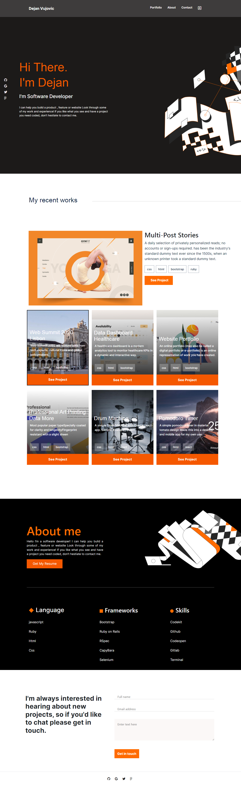

# Portfolio

Live preview [here](https://vudej.github.io/Portfolio/). 

## Screenshots

## Contents
* [Homepage](#homepage)
* [Projects](#projects)
* [About me](#about)
* [Contact](#contact)
* [Hamburger menu](#mobile)
* [Pop-up window for projects](#projects)

## General info
This project is my first Portfolio as web developer.
	
## Technologies
Project is created with:
* HTML
* CSS
* Bootstrap
* Javascript

	
## Setup
To run this project, install it locally using:
$ cd Desktop
$ git clone https://github.com/VuDej/Portfolio.git

## Author

👤 **Dejan Vujovic**

- Github : [@VuDej](https://github.com/VuDej)
- Twitter: [@DejanVuj](https://twitter.com/DejanVuj)
- LinkdIn : [@Dejan-Vujovic](https://www.linkedin.com/in/dejan-vujovic-5a0672225/)

## 🤝 Contributing

Contributions, issues, and feature requests are welcome!

Feel free to check the [issues page](https://github.com/VuDej/Responsive-Web-Design/issues/6).

## Show your support

Give a ⭐️ if you like this project!

## Acknowledgments

- A special thanks to Microverse for inspiring this project. We are indebted to you all at Microverse
- A special thanks goes to all our peers at Microverse for being there for us.

## 📝 License

This project is [MIT](LICENSE) licensed.

## Contact
Created by [@VuDej](https://github.com/VuDej) - feel free to contact me!

